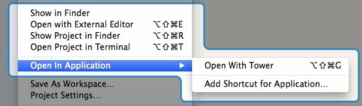
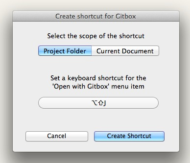

# About Open with Application
Open with… is a simple plugin for Xcode that makes it easy to open the current project or the focused file either in the Finder or the Terminal, or any other application of your choice. You can also assign custom keyboard shortcuts.

Holding down the Control key while entering the menu will allow you to choose the application used as the external editor.

---------------------------------

# Installation
You can either install using the Alcatraz plugin manager or by building it yourself.

Building the project will install the plug-in in the '~/Library/Application Support/Developer/Shared/Xcode/Plug-ins' folder. Simply remove it and restart Xcode to uninstall the plugin.

# License
Released under the MIT license:	[http://opensource.org/licenses/mit-license.php](http://opensource.org/licenses/mit-license.php)

Links against ShortcutRecorder which is under the BSD license